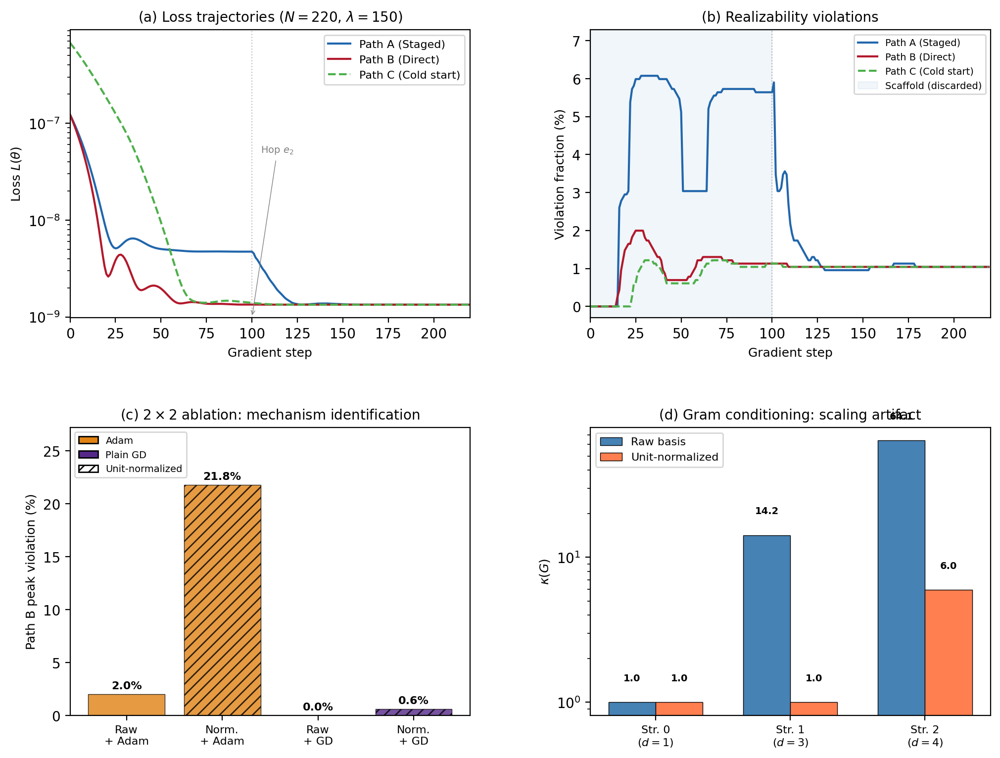

# OpDiscovery-FluidMech: The Geometrization of Design Spaces

An implementation and validation framework for **The Geometrization of Design Spaces**, applied to invariant operator discovery and turbulence closure modeling in fluid mechanics.

## Overview

Configuration spaces in engineering and physics are hybrid:
- **Discrete**: Primitive selection, symbolic graph skeletons, differential operators.
- **Continuous**: Physical parameters, coefficients, scale lengths.
- **Semantic**: Conservation laws, Galilean and frame invariance, realizability boundaries (Lumley triangle).

This project formalizes the design space of turbulence closures as a **stratified design atlas** $(B, \{\Theta_t\}, \{R_t\}, L, E, \{T_e\}, \sim)$, where:
- Strata $\Theta_t$ are parameter manifolds of specific constitutive model families (e.g. Linear Boussinesq, Quadratic Pope expansion, Non-local gradient terms).
- Edits $e \in E$ are structural transitions between grammar skeletons.
- Transport maps $T_e: \Theta_t \to \Theta_{t'}$ carry calibrated parameters and optimizer state smoothly across structural mutations without catastrophic forgetting.
- Two-tiered controllability separates pointwise algebraic tensor completeness from operator-compositional PDE reachability.

## Canonical Benchmark: Turbulent Square Duct Flow

Turbulent square duct flow exhibits Prandtl's secondary motion of the second kind: 8 counter-rotating streamwise vortices driven by Reynolds stress anisotropy $(\tau_{yy} - \tau_{zz} \neq 0$ and $\tau_{yz} \neq 0$).
- **Stratum 0 (Linear Boussinesq, 1D):** $S_{yy} - S_{zz} = 0$ mathematically fails with near-zero controllability alignment ($\cos \theta_{\text{sec}} = 0.000115 \approx 0$) and anti-aligned secondary vorticity forcing ($\rho = -0.15732$, $29.38\%$ reversed forcing domain).
- **Stratum 1 (Quadratic Pope, 3D):** Non-linear Pope expansion fully spans the required anisotropic tensor space ($\cos \theta_{\text{sec}} = 1.000000$).
- **Stratum 2 (Cubic Pope, 4D):** Incorporates the cubic invariant tensor $T^{(4)} = \frac{k}{(C_\mu \omega)^3}(S^2 \Omega - \Omega S^2)$.

## Key Results

### 1. Exact Canonical Transport ($\delta_R = 0.0000$)
Analytical embedding $T_e(\theta) = [\theta, 0]$ guarantees exact zero realization drift across stratum transitions:
- $\delta_R(0 \to 1) = 0.000000 \times 10^0$
- $\delta_R(1 \to 2) = 0.000000 \times 10^0$
- $\delta_R(0 \to 2) = 0.000000 \times 10^0$

### 2. The Physical Curriculum Mechanism (Gram Matrix Conditioning)
The task loss Hessian is the spatial Gram matrix $G_{ij} = \int_\Omega \operatorname{Tr}(T_i T_j) dA$:
- $\kappa(G_0) = 1.00$ (Scalar Boussinesq)
- $\kappa(G_1) = 14.24$ (Well-conditioned quadratic system)
- $\kappa(G_2) = 64.10$ ($4.5\times$ conditioning jump due to $T_3 - T_4$ cross-coupling)

Sequential traversal ($\mathcal{M}_0 \to \mathcal{M}_1 \to \mathcal{M}_2$) partially diagonalizes this ill-conditioned system, solving the $\kappa = 14.24$ subproblem before deploying the cubic term.

### 3. Traversal Dynamics (Budget-Matched $N = 220$)
- **Path A (Physical Curriculum):** Tolerates pre-existing violation in the non-deployed Stratum 1 scaffold ($5.64\%$), enabling the deployed Stratum 2 model to achieve rapid, essentially monotone repair ($5.64\% \to 1.04\%$) and dip-free secondary forcing alignment ($\rho > 0.999$).
- **Path B (Direct Joint Calibration):** Manufactures a $2.00\%$ transient realizability excursion, triggering a $2\times$ optimization loss rebound (steps 21–27) and fidelity dips upon boundary collision.
- **Penalty Sweep ($\lambda \in \{0, 150, 1500\}$):** Confirms the excursion is trajectory-mediated and penalty-modulated (peak violation is largest at $\lambda=0$ with $2.78\%$).
- **Asymptotic Agreement:** Semantic realization defect $C_{AB} = 6.93 \times 10^{-6}$ confirms both paths converge to the identical physical basin.

## Repository Structure

- [`PAPER_DRAFT.md`](PAPER_DRAFT.md): Complete, publication-ready research manuscript.
- [`curvature_experiment.py`](curvature_experiment.py): 3-stratum budget-matched curvature & physical curriculum experiment.
- [`results_curvature_experiment.json`](results_curvature_experiment.json): Audited telemetry database for Path A, Path B, and the $\lambda$-sweep.
- [`prototype_square_duct.py`](prototype_square_duct.py): Baseline square duct environment, mesh generation, and controllability alignment.
- [`plot_secondary_flow.py`](plot_secondary_flow.py): Secondary flow streamlines and normal stress anisotropy visualization.
- [`curvature_results.png`](curvature_results.png): 4-panel figure (Loss trajectories, realizability dynamics, penalty sweep, Gram conditioning).
